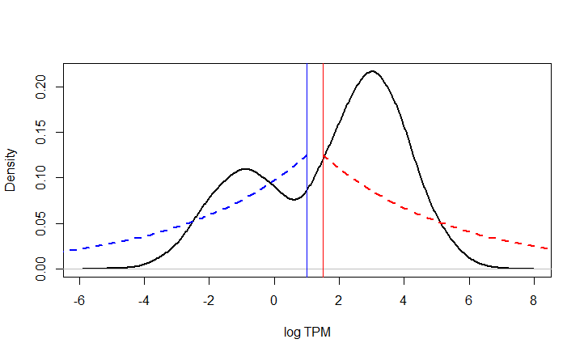
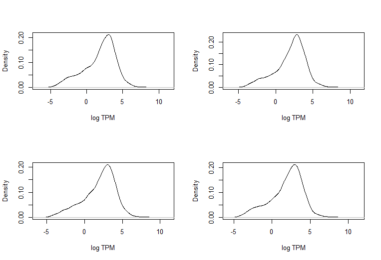
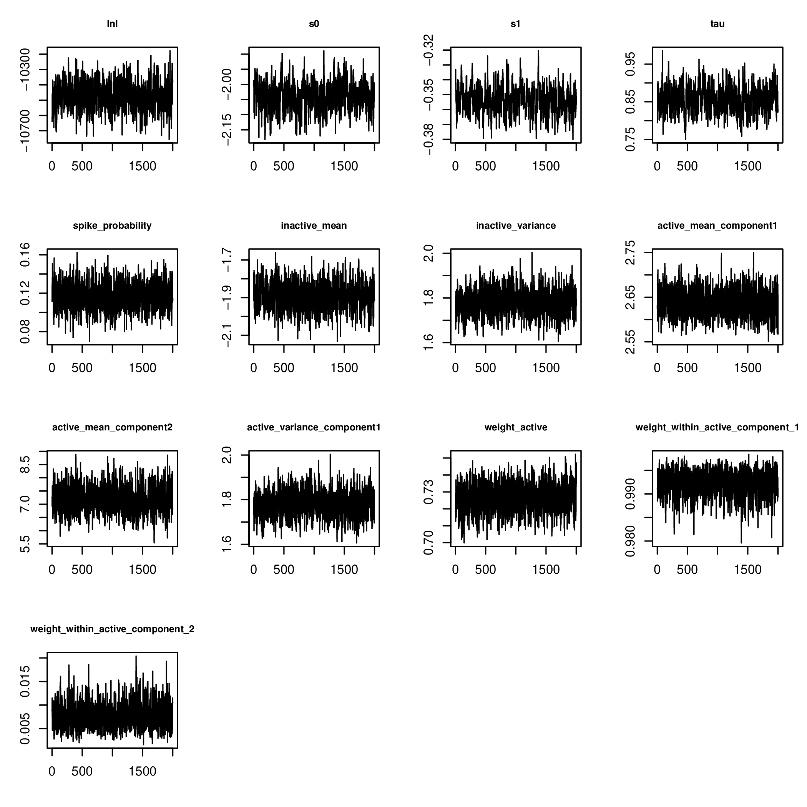
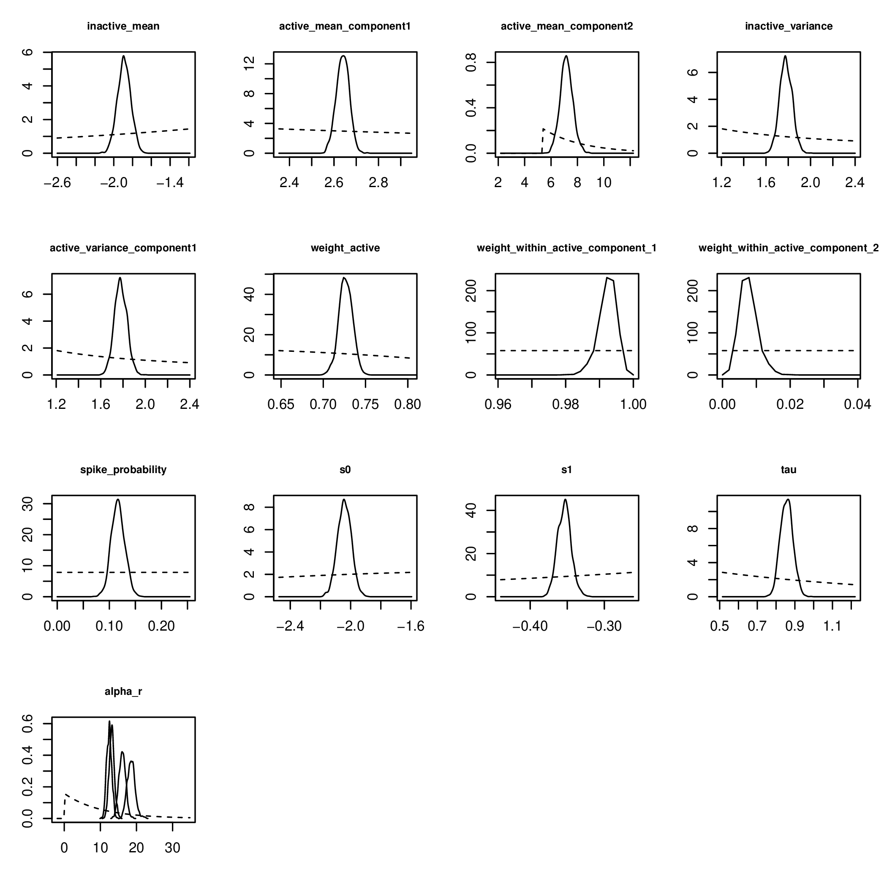
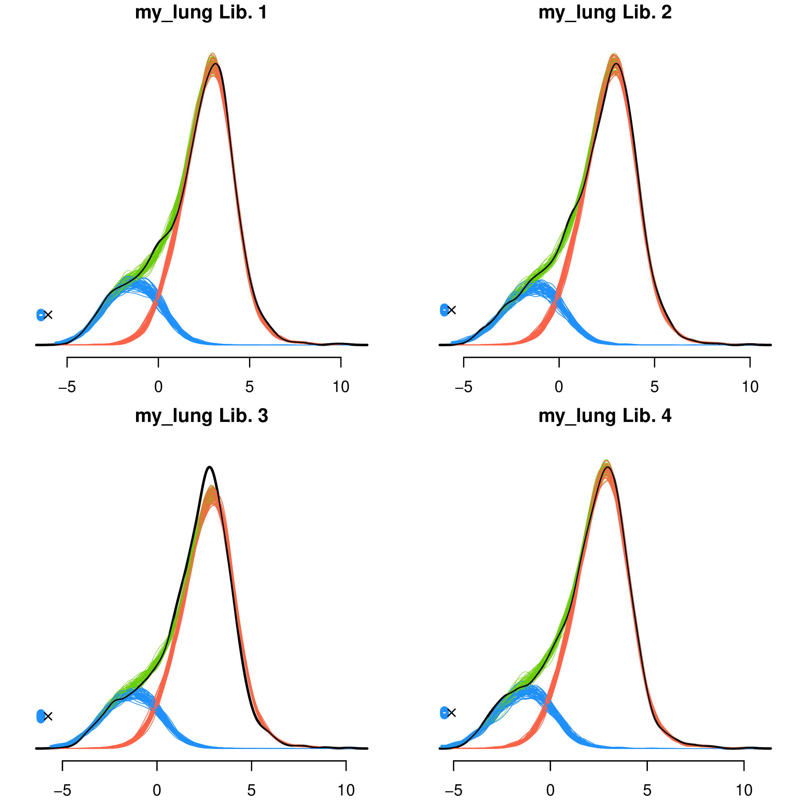
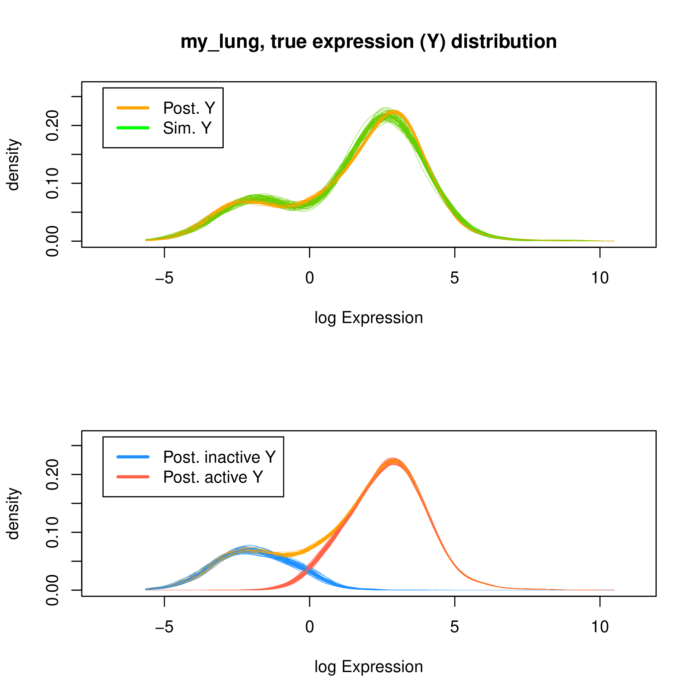

```{r setup, include=FALSE}
knitr::opts_chunk$set(echo = TRUE)
knitr::opts_knit$set(root.dir = "..")
```

### Introduction

Zigzag computes the posterior probability each gene in a genome or gene set is actively expressed in a transcriptome. To compute these probabilities, zigzag uses Markov Chain Monte Carlo (MCMC) to sample from the posterior distribution of a hierarchical mixture model given relative expression estimates (e.g. TPM or FPKM) in a set of biological replicates ( [Thompson et al. 2020](https://www.pnas.org/content/117/32/19339) ).

### Model assumptions

Zigzag assumes the data follows a finite mixture model consisting of one inactive distribution and one or more active distributions. Each mixture component follows a Normal distribution on a log-scale, i.e. symmetric, bell-shaped distributions with low-expressed genes displaying dropout (zero reads) from binomial sampling error.

### Summary of Analysis procedure

First, specify the finite mixture model by setting the number of mixture components. In our experience, in addition to the inactive mixture component, two active components are often necessary and sufficient to provide a good fit to the data.

A naive approach is to run an analysis under default settings, sample from the joint posterior distribution of model parameters and use posterior-predictive simulation to assess the adequacy of this model. If determined to be inadequate (simulated data do not resemble the real data) then specify a more complex model by adding more mixture components and reanalyzing. Repeat this until an adequate model is found or you no longer see improvement in model fit. If you are unable to find a good enough fit, then the model assumed by zigzag may not be a good approximation of the process that generated your data.

To aid others as they interpret your results, include detailed reports of posterior sensitivity to prior assumptions and model fit/adequacy using posterior-predictive simulation (see sections below).

A key challenge to fitting mixture models to data, is the non-identifiability of mixture copmonent means, variances and weights. This is because the likelihood is invariant to the index of the component parameters. This is often referred to as the label switching problem. 

We find a simple and effective way to impose identifiability constraints is to specify shifted gamma prior distributions for the component mean parameters designed to minimize the overlap of their support. For each mean, an offset or threshold  is set as a lower bound for active mixture component's prior distribution and an upper bound of the inactive mean prior distribution (set by parameters threshold_a for active and threshold_i for inactive; see figure below).

<figure>
<div style="text-align: center;">
  
</div>
  <figcaption style="margin-left: 150px;margin-right: 150px;">
  Figure 1. Component mean parameter prior distributions. In black is the distribution of true, unobserved gene expression. The model assumes a two-component latent mixture model where the prior distribution for the inactive component mean is exponential shifted up by 1 and reversed (blue dashed line). The active component mean has an exponential prior shifted to the right by 1.5 (red dashed line).
  
  
  </figcaption>
</figure>

<br>

Zigzag, by default, uses kernel density estimation to automatically select a model with one or two active components and set prior offsets or thresholds for all component means. In our experience, the range of the posterior distribution of the inactive mean is consistently below 1 log TPM and that of the active mean(s) is(are) consistently greater than -1 log TPM. This may not be true for all data sets. We find this works well as a starting point, but careful inspection of posterior sensitivity to prior assumptions as well as posterior predictive checks are necessary to find an adequate model in zigzag.


In the tutorial below we will analyze a small example data set of expression level estimates in units of TPM downloaded from the GTEx database. This data is included in the zigzag repository in the data subdirectory.

The tutorial describes the following steps for conducting Bayesian analysis with zigzag:

- MCMC: Burn-in.
- MCMC: Simulate draws from model posterior.
- Check MCMC quality.
- Check posterior sensitivity and adequacy.
- Analyze and interpret posterior sample.


<br>

### Create zigzag object
To create a zigzag object you will need expression data and gene length data. Although you can run an analysis without gene length data, you may get biased estimates if gene lengths vary among genes.

First, load Expression and Gene Length Data into R
```{r import expression data, echo=TRUE}
expression_data <- read.table("data/example_lung.tpm", header = T, row.names = 1)
head(expression_data)
```

zigzag requires the data contain row names which are gene names. Ensure the row names correspond in the gene length and expression files. If no gene length data is provided, zigzag assumes all genes have equal gene length.

```{r import gene lengths, echo = TRUE}
human_gene_lengths <- read.table("data/example_gene_length.txt", header = T, row.names = 1)
head(round(human_gene_lengths, digits = 1))
```

Here is what the log TPM distribution looks like for the expression data in example_lung.tpm:

<figure>
<div style="text-align: center;">
  
</div>
  <figcaption style="margin-left: 150px;margin-right: 150px;">
  Figure 2. Density plots of exprssion data from human lungs example.
  
  
  </figcaption>
</figure>


<br>

#### Get gene lengths
When you analyze your own data, you will need to obtain mean transcript lengths for each gene. There are many tools available to do this such as GTFtools. In the scripts directory, we have provided a bash script called compute_gene_transcripts_length.sh which calculates the average length of transcripts belonging to each gene from a gtf/gff annotation file. Best to run it on a computer with many cores. It probably isn’t the fastest tool for this job. To use, ensure Rscript is installed on your system. You will also need to know the tags for gene id and transcript id in column 9 of the gtf file. Column 9 is the semicolon-delimited attributes column for each feature (e.g. exon, CDS, gene, etc.). Usually, “gene_id” and “transcript_id” are the tags. For example the attributes tags for genes and transcripts (red text) for an exon appear as:

gene_id “FBgn0052816”; gene_symbol “CG32816”; transcript_id “FBtr0070102”; transcript_symbol “CG32816-RA”;

For help type: 
```{bash eval = FALSE}
compute_gene_transcripts_length.sh -h
```


<br>

#### Load data into a zigzag object and set priors
Next, create a zigzag object. This object contains all the parameters in the mixture model as well as the functions for generating and analyzing samples from the posterior distribution. zigzag instances are Refclass objects. Their member variables and methods are accessed with the $ symbol: zigzag_object\$method(), or zigzag_object\$variable. 

Load the expression data and gene length data into a zigzag object. By default zigzag will use kernel density estimation to estimate number of active subcomponents and thresholds for component mean priors will be estimated from the data based on the number of active components specified or estimated internally by zigzag. Zigzag uses the output_directory variable to create a directory where all output files will be written. To see all zigzag variables and default settings including hyperpriors type ?zigzag in the Rstudio console.

You should create at the very least two zigzag objects and run independent analyses for each to check that chains are converging on the same distribution. We'll analyze the data under default prior settings by creating a zigzag object with the code below:

```{r zigzag-object, echo = TRUE, eval = FALSE}
library(zigzag)
my_zigzag <- zigzag$new(data = expression_data, gene_length = human_gene_lengths, 
                       output_directory = "data/example_zigzag_output")
```

When the zigzag object is created, the hyperprior settings will be summarized in a file in your output_directory in  my_zigzag_output/hyperparameter_settings.txt. Here zigzag set the number of active mixture components equal to 2 and set prior mean threshold parameters: threshold_i	= 0.31, and threshold_a =	c(0.31, 5.39).


<br>

### Run "burnin" until chain converges
Use the burnin function to run run the MCMC until it converges and auto-tune proposal size parameters for efficient mixing. Below we will run the analysis for 5,000 generations sampling every 50 generations from the chain. If write_to_files = TRUE, the burnin sample will, by default, be written to files in a directory called my_zigzag_output/output_burnin. Type ?zigzag::burnin for more details.
```{r burn-in, echo = TRUE, eval = FALSE}
my_zigzag$burnin(sample_frequency = 50, ngen=5000, write_to_files = TRUE)
```
Evaluate the burnin log files to determine if the chain has converged to the stationary distribution. If the chain has not converged, then simply call burnin again setting ngen to a higher number. The burnin will proceed from the generation you left off. New log files will be created unless you set the append parameter = TRUE.

If satisfied that all parameters have converged, proceed to run the mcmc.


<br>

### Run MCMC
To sample from the posterior distribution, use the mcmc function. To run posterior-predictive simulation during the mcmc, set run_posterior_predictive = TRUE. New data will be simulated from model parameters sampled from the chain at regular intervals. Various discrepancy statistics and plots will be measured and created. See [Thompson et al. 2020](https://www.pnas.org/content/117/32/19339)  supplemental information for details.
```{r mcmc, echo = TRUE, eval = FALSE}
my_zigzag$mcmc(sample_frequency = 10, ngen = 20000, run_posterior_predictive = TRUE, mcmcprefix = "my_lung")
```
In the MCMC output directory, data/example_zigzag_output/my_lung_mcmc_output/, are the posterior log files and probability of active expression file. Contained within is also a subdirectory called mcmc_report with MCMC trace files (e.g. Figure 3), posterior and prior distribution plots (Figure 4), and ESS estimates for model parameters to assess efficiency and quality of MCMC sample. If ESS is small, call mcmc again setting append = TRUE.  Type ?zigzag::mcmc for more details.


<figure>
<div style="text-align: center;">
  
</div>
  <figcaption style="margin-left: 150px;margin-right: 150px;">
  Figure 3. MCMC traces.
  
  
  </figcaption>
</figure>

<br>

Check the *_mcmc_output/mcmc_report/*_posterior_distributions.pdf file (Figure 4 below) which shows marginal posterior distributions relative to prior distributions to see how strongly the prior influences the posterior for each parameter. If the posterior is sensitive to the specified prior you may want to try a weaker prior setting.


<figure>
<div style="text-align: center;">
  
</div>  <figcaption style="margin-left: 150px;margin-right: 150px;">
  Figure 4. Posterior and prior density overlay plots. The dashed lines show the prior densities and solid lines the posterior densities. 
  
  
  </figcaption>

</figure>

Confirm all independent MCMCs converged on the same stationary distribution for all parameters. MCMC files can be compared visually using [Tracer](https://github.com/beast-dev/tracer/releases/tag/v1.7.2)  Also, check that all runs produce the same estimates of the probability of active expression for all genes. If you see a significant difference for some genes, that indicates those genes didn’t converge. Check the mcmc traces for Y<sub>g</sub> and &sigma;<sup>2</sup><sub>g</sub>.


<br>

### Evaluate model adequacy with posterior predictive simulation
Model-based inference is based on the premise that our inference model provides an adequate description of the process that gave rise to our data. The Bayesian approach for assessing model adequacy is called posterior-predictive assessment (Gelman et al. 1996). This approach is based on the following idea: if the inference model is a good approximation of the process that gave rise to our observations, then we should be able to use the posterior distribution of that model to simulate new data sets that resemble the original data set.

To compare real data to simulated data we use a summary statistic to quantify the resemblance between the data sets. By repeatedly simulating data sets from the joint posterior distribution of the model parameters, we can construct a predictive distribution of summary statistics and compute the difference between the statistic computed from the simulated and from the observed data. A difference close to zero indicate we are able to infer a model that generates similar data.

When running the mcmc function, if run_posterior_predictive = TRUE, zigzag will periodically sample from the mcmc chain to simulate data and measure three discrepancy statistics: two different Wasserstein realized discrepancy statistics and the "Rumsfeld" statistic (See section S1.5 in Thompson et al. 2020 for details). Zigzag also creates density plots of the simulated libraries and overlays them with the real data libraries (Figure 5) to provide a visual of how well the model's prediction of new data agrees with the data fit to the model. Zigzag also provides similar plots of the latent mixture posterior distribution compared with posterior predictive distribution from simulated latent mixture distribution (Figure 6).

<figure>
<div style="text-align: center;">
  
</div>
  <figcaption style="margin-left: 150px;margin-right: 150px;">
  Figure 5. Posterior predictive plots of library log TPM distributions. Blue shows the inactive predictive log TPM and red the active. Black curves are the original data distributions of log TPM for the four lung libraries.
  
  
  </figcaption>
</figure>

<br>

<figure>
<div style="text-align: center;">
  
</div>
  <figcaption style="margin-left: 150px;margin-right: 150px;">
  Figure 6. Posterior predictive plots of latent mixture model true expression distributions. Each curve shows the a distribution of latent expression levels from a sample from the posterior distribution. Top: Orange curves are the posterior samples of $Y_g$ for all genes and the green curves show the posterior predictive distributions from simulating new $Y_g$ from the mixture model posterior samples. Bottom shows the orange distribution decomposed into inactive and active distributions. 
  
  
  </figcaption>
</figure>

<br>

If, for example, the posterior distributions for the mixture component means are concentrated at the prior offset (threshold) then set that to a value farther away using the threshold_a and threshold_i settings. For example:
```{r zigzag-object-2, echo = TRUE, eval = FALSE}
my_zigzag <- zigzag$new(data = expression_data, gene_length = human_gene_lengths, 
                       output_directory = "data/example_zigzag_output", num_active_components = 2,
                       threshold_i = 1, threshold_a = c(1, 4))
```
<br>

### Analyze and interpret posterior sample
The posterior probability of active expression for each gene is found in the file: example_lung_probability_active.tab. If more than two active components are specified in the model, then the file example_lung_probability_in_component.tab gives the probability each gene is in each of component in the model. 
```{r prob active, echo = TRUE}
prob_active <- read.table("data/example_zigzag_output/my_lung_mcmc_output/my_lung_probability_active.tab",
                         header = T, row.names = 1)

head(n=10, cbind(expression_data, prob_active))
```
